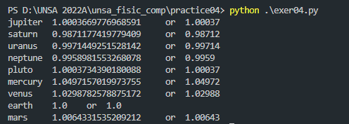

<div align="center">
<table>
    <theader>
        <tr>
        <td style="width:50%; height:auto"></td>
            <th>
                <span style="font-weight:bold;">UNIVERSIDAD NACIONAL DE SAN AUGUSTIN</span><br />
                <span style="font-weight:bold;">FACULTAD DE INGENIERÍA DE PRODUCCIÓN Y SERVICIOS</span><br />
                <span style="font-weight:bold;">ESCUELA PROFESIONAL DE INGENIERÍA DE SISTEMAS</span>
            </th>
        <td></td>
                  </tr>
    </theader>
    <tbody>
        <tr><td colspan="3"><span style="font-weight:bold;">Formato</span>: Guía del Estudiante / Talleres / Centros de Simulación</td></tr>
        <tr><td><span style="font-weight:bold;">Aprobación</span>:  2022/03/01</td><td><span style="font-weight:bold;">Código</span>: GUIA-PRLD-001</td><td><span style="font-weight:bold;">Página</span>: 1</td></tr>
    </tbody>
</table>
</div>
<div align="center">
<span style="font-weight:bold;">GUÍA DEL ESTUDIANTE</span><br />
<span>(formato del estudiante)</span>
</div>


<table>
<theader>
<tr><th colspan="6">INFORMACIÓN BÁSICA</th></tr>
</theader>
<tbody>
<tr><td>ASIGNATURA:</td><td colspan="5">Fisica Computacional</td></tr>
<tr><td>TÍTULO DE LA PRÁCTICA:</td><td colspan="5">Practica 04</td></tr>
<tr>
<td>NÚMERO DE PRÁCTICA:</td><td>04</td><td>AÑO LECTIVO:</td><td>2022 A</td><td>NRO. SEMESTRE:</td><td>III</td>
</tr>
<tr>
<td>FECHA INICIO::</td><td>jUN-2022</td><td>FECHA FIN:</td><td>07-Jun-2022</td><td>DURACIÓN:</td><td>04 horas</td>
</tr>
<tr><td colspan="6">ALUMNO:
<ul>
<li>Cozco Mauri Yoset >>> ycozco@unsa.edu.pe</li>
</ul>
</td>
</<tr>
<tr><td colspan="6">DOCENTES:
<ul>
<li> DANNY GIANCARLO APAZA VELIZ</li>
</ul>
</td>
</<tr>
</tdbody>
</table>


<table>
<theader>
<tr><th colspan="6">SOLUCIÓN Y RESULTADOS</th></tr>
</theader>
<tbody>
</tr>
<tr><td colspan="6">
<tr>

## I. SOLUCIÓN DE EJERCICIOS PROBLEMAS:
<br>
<tr>

## Ejercicio 1:
-   A partir de la segunda ley de movimiento de Newton y la ley de gravitación universal realice un código que permita determinar el valor de la gravedad para cualquier planeta del sistema planetario solar. A partir de la segunda ley de movimiento de Newton y la ley  de gravitación universal realice un código que permita determinar el valor de la gravedad para cualquier planeta del sistema planetario solarmedir la gravedad a una distancia h (del planeta)

## VARIABLES
- distancia sol a la medida => r = R+h
- R = distancia del sol al planeta 
- F = m.a
- F = m . g
- F = Fg
- Ms . g = G Ms Mp / r^2
- g = G Mp/ r^2
- g = G Mp/(R+h)^2
- h<= 2r  (r =  radio del planeta en cuestion) 
- Ley dfe gravitacion 
- F = cteGravi*( Ms Mp)/ (distancia que los separa^2)

```python
def get_gravity_any_planet(planet_mass, planet_radius, planet_altitude):
    G = 6.67408 * 10**-11
    result = 0
    if(planet_altitude<=planet_radius):
        result = G * planet_mass  / ((planet_radius+planet_altitude)**2)
    else: 
        result = "recuerda que la condicion de altitud a medir debe cumplir que la altitud sea menor o igual al diametro del planeta"
    return result
#test for mercury
print("mercury\t",get_gravity_any_planet(3.3022*10**23, 2439.7*10**3, 0))
#test for venus
print("venus\t",get_gravity_any_planet(4.8685*10**24, 6051.8*10**3, 0))
#test for earth
print("earth\t",get_gravity_any_planet(5.9736*10**24, 6371*10**3, 0))
print("test earth with distance = 7000000")
print("earth\t",get_gravity_any_planet(5.9736*10**24, 6371*10**3, 7000000))
#test for mars
print("mars\t",get_gravity_any_planet(6.4185*10**23, 3389.5*10**3, 0))
#test for jupiter
print("jupiter\t",get_gravity_any_planet(1.8986*10**27, 69911*10**3, 0))
#test for saturn
print("saturn\t",get_gravity_any_planet(5.6834*10**26, 58232*10**3, 0))
#test for uranus
print("uranus\t",get_gravity_any_planet(8.6810*10**25, 25362*10**3, 0))
#test for neptune
print("neptune\t",get_gravity_any_planet(1.0243*10**26, 24622*10**3, 0))
```
**resultados** <br>


</tr>
<tr>

## Ejercicio 02
-  Del problema anterior realice un código para poder determinar la densidad de cualquier planeta del sistema planetario solar.
    
```python
def get_density(planet_mass, planet_radius):
    volume = (4/3)*3.14*(planet_radius**3)
    density = (planet_mass/volume)
    return str(density) +" kg/m^3  \t OR " + str(density/1000) + " g/cm^3"
#test for mercury
print("mercury",get_density(3.3022*10**23, 2439.7*10**3))
#test for venus
print("venus",get_density(4.8685*10**24, 6051.8*10**3))
#test for earth
print("earth",get_density(5.9736*10**24, 6371*10**3))
#test for mars
print("mars",get_density(6.4185*10**23, 3389.5*10**3))
#test for jupiter
print("jupiter",get_density(1.8986*10**27, 69911*10**3))
#test for saturn
print("saturn",get_density(5.6834*10**26, 58232*10**3))
#test for uranus
print("uranus",get_density(8.6810*10**25, 25362*10**3))
#test for neptune
print("neptune",get_density(1.0243*10**26, 24622*10**3))

```
**resultados**<br>

</tr>

<tr> 

## Ejercicio 03
- Implementar un código computacional para la solución de la segunda ley de Kepler.

## variables y ecuaciones
- Velocidad aerolar  
- VA = da/dt
- da = 1/2*r^2*(diferencial de teta)
- dt = 1/2*r^2*w
- dt = 1/2*r^2*(velocidad angular)
- Segunda ley de kepler  establece que la velocidad aerolar es constante 
- VA = 1/2*r^2*w
- V_t = Componente transversal
- se cumple que r1^2 * w1 = r2^2 * w2    >>> si r1<r2 entonces  w1>w2
- r1*V_t1 = r2*V_t2     
En el afelio y perihelio el componente transversal es igual a la velcoidad del planeta
cumpliendose tambien la siguiente relacion rp*vp = ra*va  
- (rp = radio del planeta en el perihelio / vp = velocidad del planeta en el perihelio)
- (ra = radio del planeta en el afelio / va = velocidad del planeta en el afelio)
El momento angular se conserva al no existir torque.

```python
def aerolar_velocity(planet_radius_to_sun_1, planet_angular_velocity_1, planet_radius_to_sun_2, planet_angular_velocity_2):
    gen_result = ""
    result1 = 0
    result2 = 0
    result1 = 1/2*(planet_radius_to_sun_1**2) * planet_angular_velocity_1
    result2 = 1/2*(planet_radius_to_sun_2**2) * planet_angular_velocity_2
    if(result1 == result2):
        gen_result= "los dos planetas tienen la misma velocidad aerolar r1:" + str(result1) + "/t r2:" + str(result2)
    return gen_result
```
</td>
<tr>

## Ejercicio 04
-  IImplementar un código computacional para determinar la solución de la tercera ley de Kepler para cualquier planeta que describa una órbita elíptica.
- Tercera Ley: Para cualquier planeta, el cuadrado de su período orbital (tiempo que tarda en dar una vueta alrededor del Sol) es directamente proporcioal al cubo del radio medio con el Sol.

## variables
- T = periodo actual del planeta 
- K = T^2/R^3 siempre es constante 
- K = 1 en nuestro sistema solar       

```python
def get_period_third_kepler(orbital_rad_ua,period_rad_years):
    # ua = 149597870700 Valor de una UA en metros
    result = 0
    result = (period_rad_years**2)/(orbital_rad_ua**3)
    # gen_result= round(result,2) redondea el resultado a 2 decimales
    return result

#test jupiter
print("jupiter\t",get_period_third_kepler(5.2,11.86)," \tor ", round(get_period_third_kepler(5.2,11.86),5) )
#test saturn
print("saturn\t",get_period_third_kepler(9.58,29.46)," \tor ", round(get_period_third_kepler(9.58,29.46),5) )
#test uranus
print("uranus\t",get_period_third_kepler(19.2,84.01)," \tor ", round(get_period_third_kepler(19.2,84.01),5) )
#test neptuneDDD
print("neptune\t",get_period_third_kepler(30.1,164.8)," \tor ", round(get_period_third_kepler(30.1,164.8),5) )
#test pluto
print("pluto\t",get_period_third_kepler(39.5,248.3)," \tor ", round(get_period_third_kepler(39.5,248.3),5) )
#test mercury
print("mercury\t",get_period_third_kepler(0.38,0.24)," \tor ", round(get_period_third_kepler(0.38,0.24),5) )
#test venus
print("venus\t",get_period_third_kepler(0.72,0.62)," \tor ", round(get_period_third_kepler(0.72,0.62),5) )
#test earth
print("earth\t",get_period_third_kepler(1,1)," \tor ", round(get_period_third_kepler(1,1),5) )
#test mars
print("mars\t",get_period_third_kepler(1.52,1.88)," \tor ", round(get_period_third_kepler(1.52,1.88),5) )
```
**resultados** <br>



</tr>
<tr><td colspan="6">II. SOLUCIÓN DE CUESTIONARIO: <br>


</tr>
</tr>
<tr><td colspan="6">III. CONCLUSIONES:

</tr>

</tdbody>
</table>


<table>
<theader>
<tr><th colspan="6">RETROALIMENTACIÓN GENERAL</th></tr>
</theader>
<tbody>
</tr>
<tr><td colspan="6">
<ul>
<li><a </a></li>
<li><a </a></li>
<li><a </a></li>
</ul>
</td>
</<tr>
</tdbody>
</table>


<table>
<theader>
<tr><th colspan="6">REFERENCIAS BIBLIOGRÁFICAS</th></tr>
</theader>
<tbody>
</tr>
<tr><td colspan="6">
<ul>
<li>https://es.khanacademy.org/science/fisica-pe-pre-u/x4594717deeb98bd3:leyes-de-newton/x4594717deeb98bd3:ley-de-gravitacion-universal/a/segunda-y-tercera-ley-de-kepler</li>


<li></li>
</ul>
</td>
</<tr>
</tdbody>
</table>

