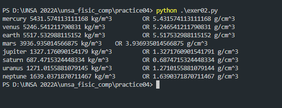

<div align="center">
<table>
    <theader>
        <tr>
        <td style="width:50%; height:auto"></td>
            <th>
                <span style="font-weight:bold;">UNIVERSIDAD NACIONAL DE SAN AUGUSTIN</span><br />
                <span style="font-weight:bold;">FACULTAD DE INGENIERÍA DE PRODUCCIÓN Y SERVICIOS</span><br />
                <span style="font-weight:bold;">ESCUELA PROFESIONAL DE INGENIERÍA DE SISTEMAS</span>
            </th>
        <td></td>
                  </tr>
    </theader>
    <tbody>
        <tr><td colspan="3"><span style="font-weight:bold;">Formato</span>: Guía del Estudiante / Talleres / Centros de Simulación</td></tr>
        <tr><td><span style="font-weight:bold;">Aprobación</span>:  2022/03/01</td><td><span style="font-weight:bold;">Código</span>: GUIA-PRLD-001</td><td><span style="font-weight:bold;">Página</span>: 1</td></tr>
    </tbody>
</table>
</div>
<div align="center">
<span style="font-weight:bold;">GUÍA DEL ESTUDIANTE</span><br />
<span>(formato del estudiante)</span>
</div>


<table>
<theader>
<tr><th colspan="6">INFORMACIÓN BÁSICA</th></tr>
</theader>
<tbody>
<tr><td>ASIGNATURA:</td><td colspan="5">Programación de Sistemas</td></tr>
<tr><td>TÍTULO DE LA PRÁCTICA:</td><td colspan="5">Practica 04</td></tr>
<tr>
<td>NÚMERO DE PRÁCTICA:</td><td>04</td><td>AÑO LECTIVO:</td><td>2022 A</td><td>NRO. SEMESTRE:</td><td>III</td>
</tr>
<tr>
<td>FECHA INICIO::</td><td>jUN-2022</td><td>FECHA FIN:</td><td>07-Jun-2022</td><td>DURACIÓN:</td><td>04 horas</td>
</tr>
<tr><td colspan="6">ALUMNO:
<ul>
<li>Cozco Mauri Yoset >>> ycozco@unsa.edu.pe</li>
</ul>
</td>
</<tr>
<tr><td colspan="6">DOCENTES:
<ul>
<li> DANNY GIANCARLO APAZA VELIZ</li>
</ul>
</td>
</<tr>
</tdbody>
</table>


<table>
<theader>
<tr><th colspan="6">SOLUCIÓN Y RESULTADOS</th></tr>
</theader>
<tbody>
</tr>
<tr><td colspan="6">
<tr>

## I. SOLUCIÓN DE EJERCICIOS PROBLEMAS:
<br>
<tr>
## Ejercicio 1:
-   A partir de la segunda ley de movimiento de Newton y la ley de gravitación universal realice un código que permita determinar el valor de la gravedad para cualquier planeta del sistema planetario solar.
A partir de la segunda ley de movimiento de Newton y la ley 
de gravitación universal realice un código que permita 
determinar el valor de la gravedad para cualquier planeta 
del sistema planetario solar
medir la gravedad a una distancia h (del planeta)

## VARIABLES
- distancia sol a la medida => r = R+h
- R = distancia del sol al planeta 
- F = m.a
- F = m . g
- F = Fg
- Ms . g = G Ms Mp / r^2
- g = G Mp/ r^2
- g = G Mp/(R+h)^2
- h<= 2r  (r =  radio del planeta en cuestion) 
- Ley dfe gravitacion 
- F = cteGravi*( Ms Mp)/ (distancia que los separa^2)

```python
def get_gravity_any_planet(planet_mass, planet_radius, planet_altitude):
    G = 6.67408 * 10**-11
    result = 0
    if(planet_altitude<=planet_radius):
        result = G * planet_mass  / ((planet_radius+planet_altitude)**2)
    else: 
        result = "recuerda que la condicion de altitud a medir debe cumplir que la altitud sea menor o igual al diametro del planeta"
    return result
#test for mercury
print("mercury\t",get_gravity_any_planet(3.3022*10**23, 2439.7*10**3, 0))
#test for venus
print("venus\t",get_gravity_any_planet(4.8685*10**24, 6051.8*10**3, 0))
#test for earth
print("earth\t",get_gravity_any_planet(5.9736*10**24, 6371*10**3, 0))
print("test earth with distance = 7000000")
print("earth\t",get_gravity_any_planet(5.9736*10**24, 6371*10**3, 7000000))
#test for mars
print("mars\t",get_gravity_any_planet(6.4185*10**23, 3389.5*10**3, 0))
#test for jupiter
print("jupiter\t",get_gravity_any_planet(1.8986*10**27, 69911*10**3, 0))
#test for saturn
print("saturn\t",get_gravity_any_planet(5.6834*10**26, 58232*10**3, 0))
#test for uranus
print("uranus\t",get_gravity_any_planet(8.6810*10**25, 25362*10**3, 0))
#test for neptune
print("neptune\t",get_gravity_any_planet(1.0243*10**26, 24622*10**3, 0))
```


</tr>
<tr>
## Ejercicio 02
-  Del problema anterior realice un código para poder determinar la densidad de cualquier planeta del sistema planetario solar.
    
```python
def get_density(planet_mass, planet_radius):
    volume = (4/3)*3.14*(planet_radius**3)
    density = (planet_mass/volume)
    return str(density) +" kg/m^3  \t OR " + str(density/1000) + " g/cm^3"
#test for mercury
print("mercury",get_density(3.3022*10**23, 2439.7*10**3))
#test for venus
print("venus",get_density(4.8685*10**24, 6051.8*10**3))
#test for earth
print("earth",get_density(5.9736*10**24, 6371*10**3))
#test for mars
print("mars",get_density(6.4185*10**23, 3389.5*10**3))
#test for jupiter
print("jupiter",get_density(1.8986*10**27, 69911*10**3))
#test for saturn
print("saturn",get_density(5.6834*10**26, 58232*10**3))
#test for uranus
print("uranus",get_density(8.6810*10**25, 25362*10**3))
#test for neptune
print("neptune",get_density(1.0243*10**26, 24622*10**3))

```

</tr>

<tr> 

-   Escriba el script dosArgumentos.sh que reciba dos argumentos y los muestre en la salida estándar, si el script
recibe una cantidad distinta de argumentos deberá mostrar un mensaje de error y terminar su ejecución.
Este ejercicio lo puede resolver con if, then, else ó con sólo if, then y usando return para terminar la
ejecución del programa.
        
```bash
#!/bin/bash
if [ $# -eq 2 ]
then
    echo "El primer argumento es $1 y el segundo es $2"
else
    echo "Error: Cantidad de argumentos incorrecta"
fi
```
</td><tr>
-  Del problema anterior realice un código para poder determinar la densidad de cualquier planeta del sistema planetario solar.

- Volumen = (4/3)*pi*r^3
- Densidad = (masa/volumen)
- Densidad = (3*massa)/(4*pi*r^3)

```python 
def get_density(planet_mass, planet_radius):
    volume = (4/3)*3.14*(planet_radius**3)
    density = (planet_mass/volume)
    return str(density) +" kg/m^3  \t OR " + str(density/1000) + " g/cm^3"
#test for mercury
print("mercury",get_density(3.3022*10**23, 2439.7*10**3))
#test for venus
print("venus",get_density(4.8685*10**24, 6051.8*10**3))
#test for earth
print("earth",get_density(5.9736*10**24, 6371*10**3))
#test for mars
print("mars",get_density(6.4185*10**23, 3389.5*10**3))
#test for jupiter
print("jupiter",get_density(1.8986*10**27, 69911*10**3))
#test for saturn
print("saturn",get_density(5.6834*10**26, 58232*10**3))
#test for uranus
print("uranus",get_density(8.6810*10**25, 25362*10**3))
#test for neptune
print("neptune",get_density(1.0243*10**26, 24622*10**3))
```
</tr>


<tr><td colspan="6">II. SOLUCIÓN DE CUESTIONARIO: <br>

- Ejecute el programa ambito.sh y luego verifique el valor de la variable PATH desde línea de comandos. ¿Qué
puede concluir de este experimento?
Se concateno el nuevo valor entregado por el usuario al valor original de la variable PATH.
Al modificar la variable PATH, podemos actualizar el valor tanto borrando o concatenando nuevos valores.


</tr>
</tr>
<tr><td colspan="6">III. CONCLUSIONES:

</tr>

</tdbody>
</table>


<table>
<theader>
<tr><th colspan="6">RETROALIMENTACIÓN GENERAL</th></tr>
</theader>
<tbody>
</tr>
<tr><td colspan="6">
<ul>
<li><a </a></li>
<li><a </a></li>
<li><a </a></li>
</ul>
</td>
</<tr>
</tdbody>
</table>


<table>
<theader>
<tr><th colspan="6">REFERENCIAS BIBLIOGRÁFICAS</th></tr>
</theader>
<tbody>
</tr>
<tr><td colspan="6">
<ul>
<li>Cannon Jason, Shell Scripting: How to Automate Command Line Tasks Using Bash Scripting and Shell
Programming. 2015.</li>


<li></li>
</ul>
</td>
</<tr>
</tdbody>
</table>

